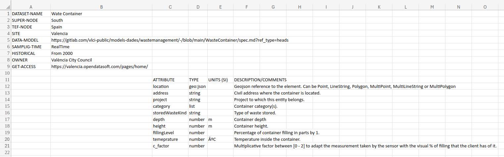
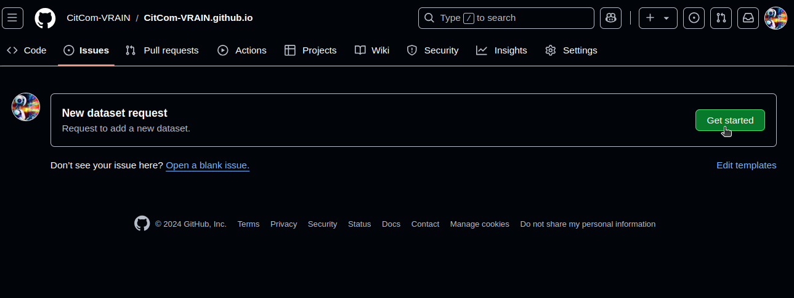
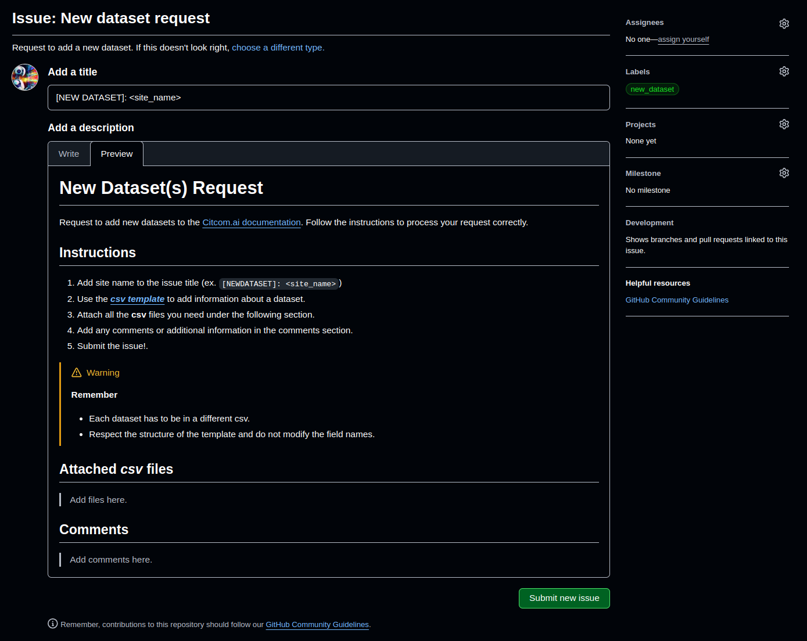
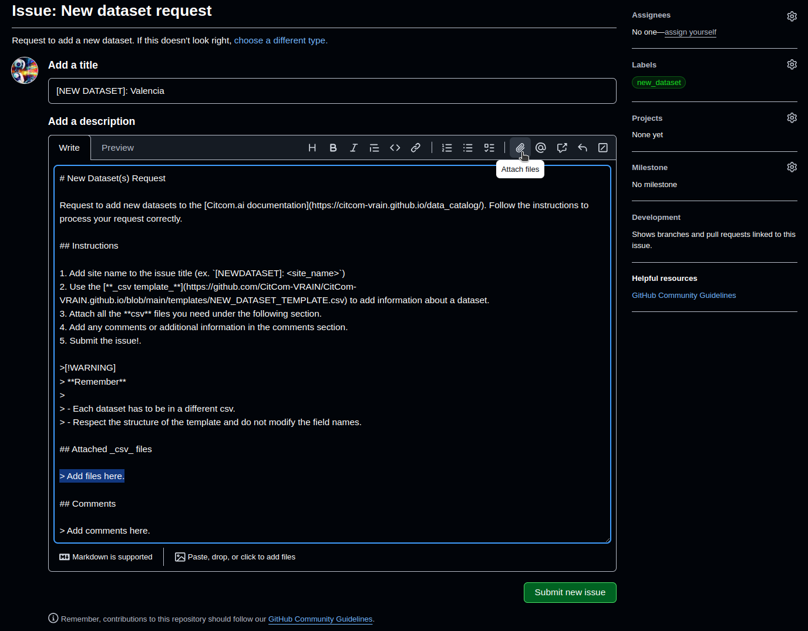
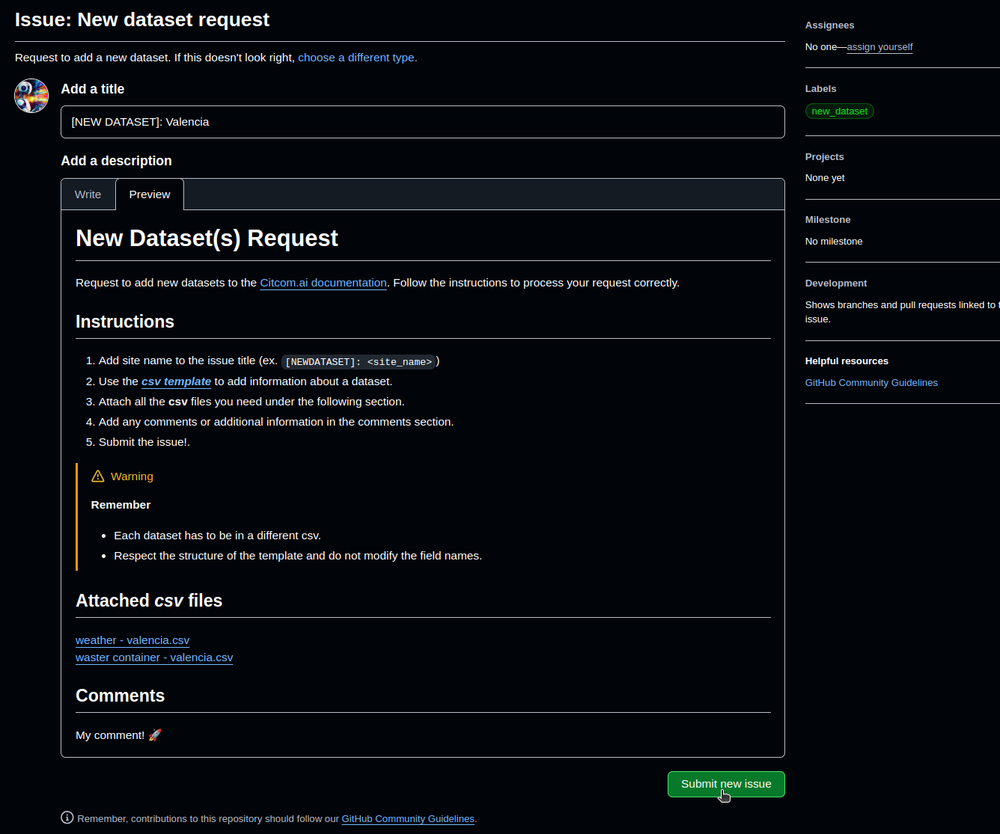
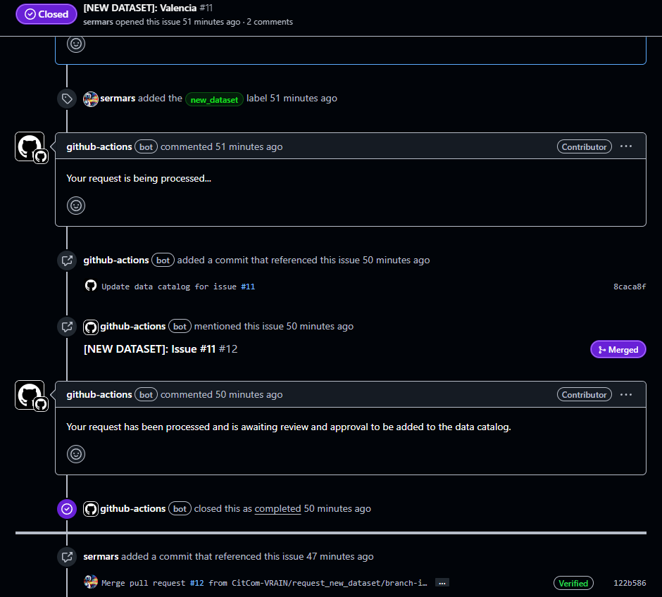

# How to add new datasets?

To add new datasets to the data catalog, an automated request system has been enabled through GitHub Issues and _csv's_ files. 

Each of the datasets that you want to add to the data catalog must be attached as a different _csv_ file. The template for this file can be found at the following link: [Dataset Template](https://github.com/CitComAI-Hub/CitComAI-Hub.github.io/blob/main/templates/NEW_DATASET_TEMPLATE.csv).

## The Dataset Template

The dataset template is a file in _csv_ format that can be divided into two parts depending on its content. 

The first part collects **general information** about the dataset:

|                  | *Description* |
| ---------------- | ------------- |
| **DATASET-NAME** | Dataset name.  |
| **SUPER-NODE**   | Name of the super node to which it belongs.| 
| **TEF-NODE** | Name of the TEF node to which it belongs. |
| **SITE** | Name of the site to which it belongs. |
| **DATA-MODEL** | Link to the data model that complies. For example, the smart data model of firmware [https://github.com/smart-data-models](https://github.com/smart-data-models). | 
| **SAMPLING-TIME** | Sampling time of the dataset (Realtime, X h/min/seg). |
| **HISTORICAL** | Historical data availability (From XXX/No). |
| **OWNER** | Owner of the dataset. |
| **GET-ACCESS** | Contact information to access the dataset. |

The second part collects **information about the fields (metadata)** of the dataset:

|                  | *Description* |
| ---------------- | ------------- |
| **ATTRIBUTE** | Variable name. |
| **TYPE** | Type of variable (Integer, Float, String, Boolean, etc.). |
| **UNITS (SI)** | Units of the variable in the International System. |
| **DESCRIPTION/COMMENTS** | Description/Explanation of the variable. |

!!! warning

    - If you do not have information to complete a field, **DO NOT delete it, LEAVE IT EMPTY**.

    - If a field is a web link, copy it in plain text, not as a hyperlink.

### Example: A filled template

The following image shows an example of a filled template:

## Making the request (GitHub Issues)

!!! warning "A [GitHub](https://github.com/) account is required."

To make the request to add new datasets to the data catalog, you must create an issue using the *New dataset request* template and follow the instructions.

From the [data catalog page](./index.md) and clicking on the `Add New Datasets` button you will directly access to adding a new issue.

In the Github Issues tab, click `Get started` in the *New dataset request* issue.

This will be the template that you must fill out.

### Filling the issue

1. **Add a Title**: Only replace the `<site_name>` with the name of the site to which the dataset belongs (e.g. `Valencia`).
2. **Attach files**: Select the `> Add files here.` line and insert the _csv_ by clicking on the paper clip in the top bar. **All the files** you attach must appear one under the other **within this *Attached _csv_ files* section**.

    

3. **Comments**: If you have any comments you can add them in the corresponding section.
4. **Submit new issue**: Once everything is complete, publish the request.

    

### Reviewing the request

Submitted the request, it will be processed automatically. Notifying in the same issue the start of the process and ending with the closing of the issue and the creation of a pull-request with the requested changes. 

This pull request will be reviewed by the site administrators and, if everything is correct, it will be accepted and the information will be added to the data catalogue. If not, the user will be notified to make the necessary corrections.