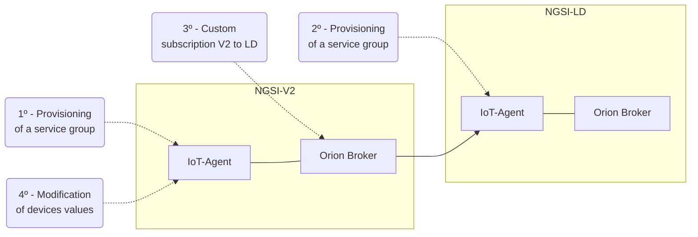

# FIWARE IoT-Agent

[Repository :simple-github:](https://github.com/CitComAI-Hub/IoTAgent.NGSI-V2_to_NGSI-LD_Subscription){:target="_blank" .md-button .md-button--primary-light }

This section explains **how to connect an NGSI-V2 broker with an NGSI-LD broker (_Fiware Orion_) through subscriptions to a _FIWARE IoT-Agent_**. This connection between brokers arises as an alternative to the use of [FIWARE Lepus](./lepus.md) due to the lack of testing and the experimental nature of this service.


## Simulation Environment

An environment has been created with docker compose that deploys in an isolated way (on two independent networks) the architectures [FIWARE NGSI-V2](https://fiware-tutorials.readthedocs.io/en/latest/getting-started.html) and [FIWARE NGSI-LD](https://ngsi-ld-tutorials.readthedocs.io/en/latest/ngsi-ld-operations.html#architecture).


 
### Services

Grouping the services according to the network or networks they belong to, we have:

- __Network NGSI-V2__ `ngsiv2_network`
    - **IoT-Agent** `ngsiv2.iotagent`
    - **Mongo DB** `ngsiv2.mongodb`
    - **Orion-V2** `ngsiv2.orionv2`
-  __Network NGSI-LD__ `ngsild_network`
    - **IoT-Agent** `ngsild.iotagent`
    - **Mongo DB** `ngsild.mongodb`
    - **LD Context** `ngsild.context`
    - **Orion-LD** `ngsild.orionld`
    - **Quantum Leap** `ngsild.quantumleap`: Fiware data persistence service
    - **CreateDB** `ngsild.cratedb`: DB for Quantum Leap.
- __Both networks__ `ngsiv2_network` y `ngsild_network`
    - **Jupyter Server**
    - **NGINX**

## Before continuing...

### Services checks

#### MongoDB connection
        
A quick way to check that the environment is correctly deployed and the different services communicate with each other is to verify the different databases and collections through MongoDB Compass:

??? example "MongoDB Compass"

    - **MongoDB-V2**: *localhost*, port `27028`
        - IoT-Agent
            * [x] *DB*: `iotagent-json`
                * [x] *Colection*: `groups`
        - Context Broker: The database will appear when it has some entity.

    - **MongoDB-LD**: *localhost*, port `27027`
        - IoT-Agent
            * [x] *DB*: `iotagent-json`
                * [x] *Colection*: `groups`
        - Context Broker
            * [x] *DB*: `orionld`
                * [x] *Colection*: `contexts`
            * [x] *DB*: `myOrion`
                * [x] *Colection* `entities`

#### Communication with the IoT-Agents

By requesting the version from the IoT-Agents, it can be easily verified that they are correctly deployed and that they are visible among the different networks of the environment.

??? example "From `jupyter-server`"

    IoT-Agent NGSI-V2:

    ```bash
    curl -X GET 'http://ngsiv2.iotagent:4041/iot/about' | jq .
    ```

    IoT-Agent NGSI-LD:

    ```bash
    curl -X GET 'http://ngsild.iotagent:4041/iot/about' | jq .
    ```

??? example "From `fiware-orionv2` to the IoT-Agent LD"

    ```bash
    curl -X GET 'http://ngsiv2.to-ngsild:4041/iot/about' | jq .
    ```

### Terminal access to the containers

To access the containers from the terminal, the command `docker exec` can be used.

```bash
docker exec -it -u <usuario> <nombre_contenedor> <sh/bash>
```

!!! example

    === "`jupyter-server`"

        ```bash
        docker exec -it orion-jupyter bash
        ```

        - Access (by default): `root`
        - Package installer: `apk`

    === "`fiware-orionv2`"

        ```bash
        docker exec -it -u root fiware-orionv2 bash
        ```
        
        - Access (by default): `nobody`
        - Package installer: `apt`

    === "`fiware-orionld`"

        ```bash
        docker exec -it fiware-orionld bash
        ```
        
        - Access (by default): `root`
        - Package installer: `yum`

### Steps for the connection between brokers

In theory, the procedure to connect two brokers through the IoT-Agent will be as follows:

1. Provisioning of a service group (_IoT-Agent_)

2. Devices creation (_IoT-Agent_)

3. Subscription (_Context Broker_)

4. Modification of devices values (_IoT-Agent_)



## Simulations

### Non-normalized data according to *data-models*

The objective of this example is to show the procedure to connect two brokers, setting aside the use of *data-models* as a normalizing element.

|   Property     |     Value      |
| -------------: | :------------- |
|     Type       | `example-type` |
| fiware-service |   `vrainIoTA`  |

!!! warning "All the code shown is designed to be run from the `jupyter-server container`"

    ```bash
    docker exec -it orion-jupyter bash
    ```

#### Provisioning of a group of services (_IoT-Agent_)

Creation of a service in the _IoT-Agent_ with the attributes that all devices belonging to this service will have.

!!! tip "Through **services**, sets of **devices** can be grouped together and the creation of these can be automated."

??? note "Editable fields (in both versions)"

    - **URL**: http://ngsiv2.iotagent:4041/iot/services
    - **Headers**:
        - **fiware-service**: vrainIoTA
        - **fiware-servicepath**: /
    - **apikey**: vrain2gpepnvsb2uv4s40d59ov (value _random_, in principle the main requirement is to maintain the length and characters).
    - **cbroker**: http://ngsiv2.orion:1026
    - **entity_type**: example-type
    - **attributes**: Modify according to the attributes of the devices. The structure of: `object_id`, `name` and `type` **must be maintained**..

=== "cURL-V2"

    ```bash
    curl -iX POST \
    'http://ngsiv2.iotagent:4041/iot/services' \
    -H 'Content-Type: application/json' \
    -H 'fiware-service: vrainIoTA' \
    -H 'fiware-servicepath: /' \
    -d '{
        "services": [
            {
                "apikey":      "vrain2gpepnvsb2uv4s40d59ov",
                "cbroker":     "http://ngsiv2.orion:1026",
                "entity_type": "example-type",
                "resource":    "/iot/json",
                "attributes": [
                    {
                        "object_id": "t",
                        "name": "temperature",
                        "type": "Number"
                    },
                    {
                        "object_id": "h",
                        "name": "humidity",
                        "type": "Number"
                    },
                    {
                        "object_id": "f",
                        "name": "fillingLevel",
                        "type": "Number"
                    }
                ]
            }
        ]
    }'
    ```

=== "cURL-LD"

    ```bash
    curl -iX POST \
    'http://ngsild.iotagent:4041/iot/services' \
    -H 'Content-Type: application/json' \
    -H 'fiware-service: vrainIoTA' \
    -H 'fiware-servicepath: /' \
    -d '{
        "services": [
            {
                "apikey":      "vrainld2gpnvsb2uv4s40d59ov",
                "cbroker":     "http://ngsild.orion:1026",
                "entity_type": "example-type",
                "resource":    "/iot/json",
                "attributes": [
                    {
                        "object_id": "t",
                        "name": "temperature",
                        "type": "Number"
                    },
                    {
                        "object_id": "h",
                        "name": "humidity",
                        "type": "Number"
                    },
                    {
                        "object_id": "f",
                        "name": "fillingLevel",
                        "type": "Number"
                    }
                ]
            }
        ]
    }'
    ```

??? note "If everything goes well, we will receive a response like this:"

    ```bash
    HTTP/1.1 201 Created
    X-Powered-By: Express
    Fiware-Correlator: c3e07e1c-62be-4ae4-8ee9-f112f585c077
    Content-Type: application/json; charset=utf-8
    Content-Length: 2
    ETag: W/"2-vyGp6PvFo4RvsFtPoIWeCReyIC8"
    Date: Wed, 25 Oct 2023 11:39:01 GMT
    Connection: keep-alive
    Keep-Alive: timeout=5
    ```

!!! info "Result in MongoDB"

    It should appear within the `iotagent-json` database, a collection `groups` and within this as many documents as services have been created.

##### Checks

The service groups can be obtained with the following request:

=== "cURL-V2"

    ```bash
    curl -X GET 'http://ngsiv2.iotagent:4041/iot/services' \
    -H 'fiware-service: vrainIoTA' \
    -H 'fiware-servicepath: /' | jq .
    ```

    ??? note "If everything goes well, we will receive a response like this:"
        
        ```bash
        {
        "count": 1,
        "services": [
            {
            "commands": [],
            "lazy": [],
            "attributes": [
                {
                "object_id": "t",
                "name": "temperature",
                "type": "Number"
                },
                {
                "object_id": "h",
                "name": "humidity",
                "type": "Number"
                },
                {
                "object_id": "f",
                "name": "fillingLevel",
                "type": "Number"
                }
            ],
            "_id": "653900b475ac594b1cc9e607",
            "resource": "/iot/json",
            "apikey": "vrain2gpepnvsb2uv4s40d59ov",
            "service": "vrainiota",
            "subservice": "/",
            "__v": 0,
            "static_attributes": [],
            "internal_attributes": [],
            "entity_type": "example-type"
            }
        ]
        }
        ```

=== "cURL-LD"

    ```bash
    curl -X GET 'http://ngsild.iotagent:4041/iot/services' \
    -H 'fiware-service: vrainIoTA' \
    -H 'fiware-servicepath: /' | jq .
    ```

    ??? note "If everything goes well, we will receive a response like this:"
        
        ```bash
        {
        "count": 1,
        "services": [
            {
            "commands": [],
            "lazy": [],
            "attributes": [
                {
                "object_id": "t",
                "name": "temperature",
                "type": "Number"
                },
                {
                "object_id": "h",
                "name": "humidity",
                "type": "Number"
                },
                {
                "object_id": "f",
                "name": "fillingLevel",
                "type": "Number"
                }
            ],
            "_id": "6540cb26101b6eba30d4d653",
            "resource": "/iot/json",
            "apikey": "vrainld2gpnvsb2uv4s40d59ov",
            "service": "vrainiota",
            "subservice": "/",
            "__v": 0,
            "static_attributes": [],
            "internal_attributes": [],
            "entity_type": "example-type"
            }
        ]
        }
        ```

!!! warning "Checklist - Before continuing..."

    To continue correctly with the example, you must have:

    - [x] **IoT-Agent V2**: Having a service created.
        - Take note (to use later) of the service's:
            - Attributes.
            - `apikey`
    - [x] **IoT-Agent LD**: Having a service created.
        - Take note (to use later) of the service's:
            - Attributes.
            - `apikey

#### Aprovisionamiento de dispositivos (_IoT-Agent_)

The _creation_ of devices can be done in two ways:

- **Manual**: By explicitly creating a device.
- **Automated**: By using a service (previously created) and modifying the values of a device from the service.

##### Manual Method

!!! info

    This section is not necessary for the correct operation of the example. It will only be necessary to know the [automated method](#automated-method-through-services) to use it after creating the subscription and verifying that it works.

A specific device is added to the created service:

=== "cURL-V2"

    ```bash
    curl -iX POST \
    'http://ngsiv2.iotagent:4041/iot/devices' \
    -H 'Content-Type: application/json' \
    -H 'fiware-service: vrainIoTA' \
    -H 'fiware-servicepath: /' \
    -d '{
        "devices": [
            {
                "device_id":   "example001",
                "entity_name": "example:example001",
                "entity_type": "example-type",
                "timezone":    "Europe/Madrid"
            }
        ]
    }'
    ```
    ??? note "If everything goes well, we will receive a response like this:"
        
        ```bash
        HTTP/1.1 201 Created
        X-Powered-By: Express
        Fiware-Correlator: 421f4048-f56d-423c-8868-088ae96965bf
        Content-Type: application/json; charset=utf-8
        Content-Length: 2
        ETag: W/"2-vyGp6PvFo4RvsFtPoIWeCReyIC8"
        Date: Wed, 25 Oct 2023 12:10:10 GMT
        Connection: keep-alive
        Keep-Alive: timeout=5
        ```
        
This process only adds a device in the IoT-Agent but does not modify the value of the attributes. To modify the device values, you must use the request of the [automated method](#automated-method-through-services).

##### Automated method (through _services_)

This method fulfills two functions:

- Create a device (if it does not exist).
- Modify the values of its attributes.

??? info "URL Structure"

    Replace the values of: `<iotagent_adress>`, `<apikey>` y `<device_id>` for the corresponding values.

    ```bash
    http://<iotagent_adress>:7896/iot/json?k=<apikey>&i=<device_id>
    ```

    !!! warning

        The port for this request changes from `4041` to `7896`.

=== "cURL-V2"

    ```bash
    curl -iX POST \
    'http://ngsiv2.iotagent:7896/iot/json?k=vrain2gpepnvsb2uv4s40d59ov&i=example001' \
    -H 'Content-Type: application/json' \
    -d '{"t": 1, "h":20, "f": 30}'
    ```

    ??? note "If everything goes well, we will receive a response like this:"

        ```bash
        HTTP/1.1 200 OK
        X-Powered-By: Express
        Content-Type: application/json; charset=utf-8
        Content-Length: 2
        ETag: W/"2-vyGp6PvFo4RvsFtPoIWeCReyIC8"
        Date: Wed, 25 Oct 2023 12:15:01 GMT
        Connection: keep-alive
        Keep-Alive: timeout=5
        ```

=== "cURL-LD"

    !!! bug "It does not work with versions higher than `2.3.0` of the IoT-Agent."

    ```bash
    curl -iX POST \
    'http://ngsiv2.to-ngsild:7896/iot/json?k=vrainld2gpnvsb2uv4s40d59ov&i=example001' \
    -H 'Content-Type: application/json' \
    -d '{"t": 1, "h":20, "f": 30}'
    ```

    ??? note "If everything goes well, we will receive a response like this:"

        ```bash
        HTTP/1.1 200 OK
        Server: nginx/1.25.2
        Date: Thu, 02 Nov 2023 11:35:07 GMT
        Content-Type: application/json; charset=utf-8
        Content-Length: 2
        Connection: keep-alive
        X-Powered-By: Express
        ETag: W/"2-vyGp6PvFo4RvsFtPoIWeCReyIC8"
        ```

###### Checks

To check the creation and modification of the values of a device, it can be done directly through MongoDB.

!!! info "Results in MongoDB"

    === "cURL-V2"

        As a result of this operation, a new database `orion-<fiware-service>` (orion-vrainiota) is created in mongodb with a `entities` collection and within this a document per device.

    === "cURL-LD"

        As a result of this operation, a new database `myOrion-<fiware-service>` (myOrion-vrainiota) is created in mongodb with a `entities` collection and within this a document per device.

#### Subscription of Orion Context Broker V2 to the IoT-Agent LD

Finally, a _custom_ subscription is created in the V2 broker, in this way, for each modification of the values of a device, the broker will send a POST request (just like the [previous one](#automated-method-through-services)) in an automated way.

=== "cURL (BrokerV2 -> IoT-Agent LD)"

    !!! bug "In the httpCustom:url, you cannot put addresses with `-`"

    ```bash
    curl -iX POST \
    'http://ngsiv2.orion:1026/v2/subscriptions' \
    -H 'Content-Type: application/json' \
    -H 'fiware-service: vrainIoTA' \
    -H 'fiware-servicepath: /' \
    -d '{
        "description": "Reenvío datos entre brokers.",
        "status": "active",
        "subject": {
            "entities": [
                {
                    "idPattern": ".*",
                    "type": "example-type"
                }
            ],
            "condition": {
                "attrs": [],
                "notifyOnMetadataChange": true
            }
        },
        "notification": {
            "attrs": [],
            "onlyChangedAttrs": false,
            "attrsFormat": "normalized",
            "httpCustom": {
                "url": "http://ngsiv2.to-ngsild:7896/iot/json",
                "method": "POST",
                "headers": {
                    "Content-Type": "application/json"
                },
                "qs": {
                    "i": "${id}",
                    "k": "vrainld2gpnvsb2uv4s40d59ov"
                },
                "json": {
                    "t": "${temperature}",
                    "h": "${humidity}",
                    "f": "${fillingLevel}"
                }
            }
        }
    }'
    ```

    ??? note "If everything goes well, we will receive a response like this:"

        ```bash
        HTTP/1.1 201 Created
        Date: Thu, 02 Nov 2023 11:56:13 GMT
        Fiware-Correlator: d244b742-7976-11ee-8fe6-0242ac130005
        Location: /v2/subscriptions/65438e5d0a524d42d10bffca
        Content-Length: 0
        ```

Analyzing in detail some elements of this request we have:

- **URL**: Points to the subscriptions of the V2 broker.
- **fiware-service**: Necessary for the subscription to work.
- **fiware-servicepath**: Necessary for the subscription to work.
- **notification**
    - **attrs**: There is no need to specify attributes as they are later selected in the body of the request.
    - **httpCustom**
        - **url**: Points to the IoT-Agent LD. Since the V2 broker network does not have direct visibility to the LD network, this address points to the reverse proxy between both networks.
        - **qs**: 
            - **k**: The `k` parameter refers to the **`apiKey` of the service in IoT-Agent of LD**.
        - **json**: This is the body of the request. It relates the `id` of the attributes in the IoT-Agent LD (`t`, `h` and `f`) with the attributes in the V2 broker (`${temperature}`, `${humidity}` and `${fillingLevel}`).

##### Checks

To verify that the subscription is working, you simply need to modify the value of a device using the IoT-Agent or directly modify an attribute of an entity in the V2 broker. In this case, the first option is chosen through the IoT-Agent.

Note how the request points to the **address of the IoT-Agent in V2**.

```bash
curl -iX POST \
'http://ngsiv2.iotagent:7896/iot/json?k=vrain2gpepnvsb2uv4s40d59ov&i=example001' \
-H 'Content-Type: application/json' \
-d '{"t": 656, "h":87, "f": "40"}'
```

??? note "If everything goes well, we will receive a response like this:"

    ```bash
    HTTP/1.1 200 OK
    X-Powered-By: Express
    Content-Type: application/json; charset=utf-8
    Content-Length: 2
    ETag: W/"2-vyGp6PvFo4RvsFtPoIWeCReyIC8"
    Date: Thu, 02 Nov 2023 12:31:00 GMT
    Connection: keep-alive
    Keep-Alive: timeout=5
    ```

After executing this request, we will observe how in MongoDB (both V2 and LD) the values of the device in question (`example001`) appear or are modified.


## References

[FIWARE IoT-Agent - Github](https://github.com/FIWARE/tutorials.IoT-Agent-JSON) Each version (V2 or LD) is located in a different branch.

[FIWARE Docu. - API Custom Notificacions](https://github.com/telefonicaid/fiware-orion/blob/master/doc/manuals/orion-api.md#custom-notifications)

[FIWARE Docu. - API httpCustom](https://github.com/telefonicaid/fiware-orion/blob/master/doc/manuals/orion-api.md#subscriptionnotificationhttpcustom)