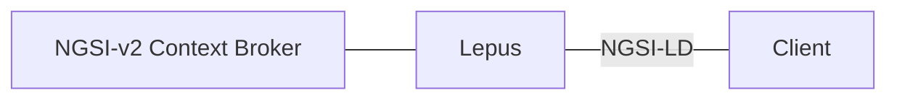

# Lepus
[Repository :simple-github:](https://github.com/jason-fox/lepus){:target="_blank" .md-button .md-button--primary-light }

**FIWARE-Lepus** is an NGSI-LD wrapper for use with NGSI-v2 Context Brokers. It understands the NGSI-LD endpoints and inputs, converts them to NGSI-v2, makes a request to the NGSI-v2 broker behind it and transforms responses back to NGSI-LD using a fixed JSON-LD @context. It supports the NGSI-LD federationOps endpoints only and is designed to be used as a registered source with NGSI-LD Context Brokers in federation mode.



## Getting started

!!! warning
    Lepus is a library still in development. It is considered untested and experimental. Errors may occur.

Create a `docker-compose.yml` file with the following config. Please, replace `NGSI_V2_CONTEXT_BROKER` with the URL / IP address of your NGSI-v2 Context Broker. Also set `CONTEXT_URL` to the desired context (for instance [WasteManagement context](https://raw.githubusercontent.com/smart-data-models/dataModel.WasteManagement/master/context.jsonld)). 

```yaml
version: '3.9'
services:
  lepus:
    image: quay.io/fiware/lepus
    build:
      context: .
      dockerfile: Dockerfile
    hostname: adapter
    container_name: lepus
    networks:
      - default
    expose:
      - "3000"
    ports:
      - "3000:3000"
    environment:
      - DEBUG=adapter:*
      - NGSI_V2_CONTEXT_BROKER=http://orion2:1026/v2
      - CONTEXT_URL=https://fiware.github.io/tutorials.Step-by-Step/tutorials-context.jsonld
      - NOTIFICATION_RELAY_URL=http://adapter:3000/notify
      - NODE_TLS_REJECT_UNAUTHORIZED=0
networks:
  default:
```

Create and start the container by using the following command:

```bash
 docker compose up
```

Set-up your AI service / client so it points to `127.0.0.1.1:3000`.

## Debugging
As mentioned above, Lepus is still in its early stages, so it lacks some features, and wild bugs may appear. In order to make it easier to detect and report errors, a [developing / debugging repository](https://github.com/CitComAI-Hub/lepus-dev) was created. If you find any issues or want to request a feature, please, open a [new issue](https://github.com/jason-fox/lepus/issues/new/choose) in the official repository.

Steps to run the development version (it is necessary to have [Node.js](https://nodejs.org/en) installed):

1. Clone the repository and navigate to its root folder:
```bash
git clone https://github.com/CitComAI-Hub/lepus-dev && cd lepus-dev
```

2. Install dependencies
```bash
npm install
```

3. Run
```bash
npm start
```

## Track and status of detected errors

- [x] Missing `NGSILD-Tenant header` (equivalent to `Fiware-Service`)   
- [x] Missing `scopeQ parameter` (equivalent to `Fiware-ServicePath`)  
- [x] Default response timeout too low for the VLCi platform   
    - Use `NGSI_V2_TIMEOUT` environment variable to set a custom value (1000ms by default)
- [x] [Missing @context property when requesting entities](https://github.com/jason-fox/lepus/issues/1) 
- [ ] HTTPS / SSL problems  
    - Lepus' protocol is http. It should be fine for working locally and testing purposes
    - `NODE_TLS_REJECT_UNAUTHORIZED=0` must be set to avoid SSL certificate checking problem
- [ ] Static context
