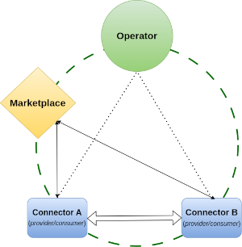
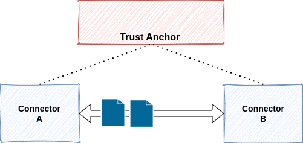

# FIWARE Data Space

Fiware is embarking on the development of different services that in combination meet the requirements defined for implementing a data space. For these developments they are following the [DSBA Technical Convergence](https://data-spaces-business-alliance.eu/wp-content/uploads/dlm_uploads/Data-Spaces-Business-Alliance-Technical-Convergence-V2.pdf) recomentations.

## Demo-Setup DSBA-compliant

As a first approximation of a future data space, Fiware developed a fairly complete example ([Demo-Setup DSBA-compliant Dataspace](https://github.com/FIWARE-Ops/fiware-gitops/tree/master/aws/dsba)), which tries to address the main blocks of a data space:

- [Data Space Operator](#data-space-operator) (TrustAnchor)
- [Marketplace](#marketplace)
- [Data Space Connector](#fiware-data-space-connector) (Provider or Consumer)

However, this example is a demo to show the feasibility of the technology, but **it is far from being easily reusable in other real environments or putting it into production systems**. Furthermore, it is designed to be deployed in [Red Hat Openshift AWS](https://aws.amazon.com/es/rosa/), so the cost of maintaining it may be a limiting factor for a simple test of the technology.

### Architectures

#### Data Space Operator

The Dataspace Operator acts as the TrustAnchor of the Data Space. It provides the particpants information on whom to trust.

#### Marketplace

The marketplace that Fiware proposes in this example is composed of the following services:

!!! warning
    
    This architecture has been derived from the different [Helm packages that form the marketplace](https://github.com/FIWARE-Ops/fiware-gitops/tree/master/aws/dsba/marketplace), so there may be some differences or connections between services that are not reflected.

#### Fiware Data Space Connector

Fiware Data Space Connector is a component that allows the data owner to share data with other participants in a secure and controlled way. 

> A more extensive documentation about the connector and the supported flows in a data space it supports can be found at the FIWARE [data-space-connector repository](https://github.com/FIWARE/data-space-connector).

To deploy the Data Space Connector Fiware provides this [repository](https://github.com/FIWARE-Ops/data-space-connector).

This component is composed of the following services:

## Minimum Data Space

As an alternative to the previous Fiware example, a minimum data space architecture is proposed, which consists of:

- [Trusted Participant/Issuers Registry](https://github.com/FIWARE/trusted-issuers-registry) (fulfilling the functions of Trust Anchor). 
- [FIWARE Data Space Connector](https://github.com/FIWARE-Ops/data-space-connector) (at least two).

This architecture is what we could call the Minimum Data Space.

### Architectures

#### Trust Anchor

For a minimal trust anchor, the Trusted Participants Registry (or *Trusted Issuers Registry*) is the unique service that is necessary. This can be managed through its [API](https://github.com/FIWARE/trusted-issuers-list/blob/main/api/trusted-issuers-registry.yaml).

#### FIWARE Data Space Connector

Check the previous [section](#fiware-data-space-connector) for more information about the Data Space Connector.
