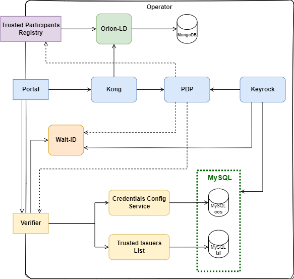
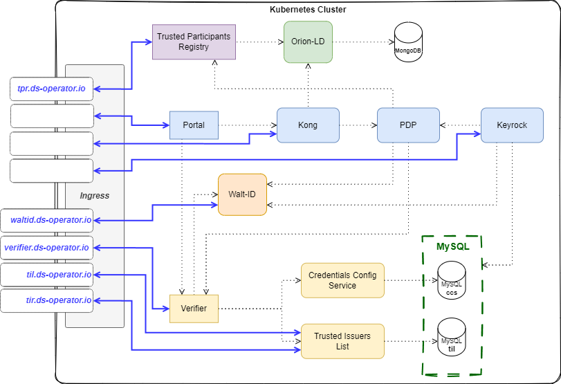

# Minimum Viable Data Space Infrastructure as a Service (MVDS-IaaS)

!!! warning
    This guide is still a work in progress. Errors may appear.

[Repository :simple-github:](https://github.com/CitCom-VRAIN/Minimum_Viable_DataSpace_Infrastructure){ .md-button .md-button--primary }

The Minimum Viable Data Space Infrastructure as a Service (MVDS-IaaS) is a set of components that are necessary to deploy a Data Space. The MVDS-IaaS is based on the [FIWARE](https://www.fiware.org/) ecosystem and is designed to be deployed on top of a Kubernetes cluster. The MVDS-IaaS is composed of the following components:

- Data Space Operator (*Trusted Issuers Registry*)
- Data Space Marketplace (*only on the [DSBA-compliant demo](https://github.com/FIWARE-Ops/data-space-connector)*)
- [FIWARE Data Space Connector](https://github.com/FIWARE-Ops/data-space-connector)

## On premise/Local deployment

The MVDS-IaaS can be deployed on a local/cloud/on-premise machine using [kind](https://kind.sigs.k8s.io/). The objective is provide an autonomous environment to test the components of the Data Space with the minimum cost and complexity possible.

### Environment setup

The environment is composed of a Kubernetes cluster created with kind, with one master node and two worker nodes. Also installed:

- [Ingress Nginx Controller](https://kind.sigs.k8s.io/docs/user/ingress/#ingress-nginx)

- [Load Balancer](https://kind.sigs.k8s.io/docs/user/loadbalancer/#installing-metallb-using-default-manifests)

### Data Space Operator

The Dataspace Operator acts as the TrustAnchor of the Data Space. It provides the particpants information on whom to trust.

#### Minimal Trust Anchor

#### DSBA-compliant demo

The DSBA-compliant demo architecture for the Data Space Operator is composed of the following components:

Also some services need external access, so the Ingress Nginx Controller is configured.

### Marketplace

!!! info "The market is not a mandatory component of having a minimal data space."

### Data Space Connector

### Status

!!! abstract inline end "_Componet Status_"

    🛑 _not started._
    
    👷 _in development..._

    ✅ _running_

|                    **Component**                        |  **Status**  | **Services Deployed** |
| ------------------------------------------------------: | :----------: | :-------------------: |
| [**Minimal Trust Anchor**](#minimal-trust-anchor)       |      ✅      |           3/3         |
| [**Data Space Connector**](#data-space-connector)       |      👷      |          13/15        |
| [**Data Space Operator (DSBA)**](#data-space-operator)  |      👷      |          11/12        |
| [**Marketplace**](#data-space-marketplace)              |      🛑      |          -/-          |

!!! info "Detailed status"

    [_Reference_](deployment_status.md)