# Minimum viable service - Waste Collection 
[Repository :simple-github:](https://github.com/CitCom-VRAIN/waste-collection-demo){ .md-button .md-button--primary }
[Live demo :material-play:](#){ .md-button .md-button--primary }

<figure markdown>
  { loading=lazy }
</figure>

## Introduction
This tutorial shows how to implement an AI-based service for optimizing city waste collection using context information and [Openroute](https://openrouteservice.org/) optimization service. This limited example illustrates how to implement a minimum viable service following MIMs embraced by the CitCom.ai project.

!!! abstract "Scenario"
    Different sensors are deployed throughout the city to monitor the fill levels of waste containers. These sensors periodically collect data on the fill levels and send it to the city data platform. The goal is to use context information to create optimal waste collection routes for the trucks. The solution will only consider the current waste container filling level, their location, available trucks, their capacity, start and end location, and time restrictions.

### Entities
The following entities in NGSI-LD format will be used: [WasteContainer](https://github.com/smart-data-models/dataModel.WasteManagement/tree/master/WasteContainer), [Vehicle](https://github.com/smart-data-models/dataModel.Transportation/tree/master/VehicleModel)~~, [FleetVehicle](), [FleetVehicleOperation](), [Road]() and [RoadSegment]()~~. Feel free to click on them and explore their corresponding Smart Data Model specifications.

### Architecture

```mermaid
graph LR
  A["🏛️ City data platform"] ---|NGSI-LD| B["🤖 AI service"];
  B --- C["📈 Dashboard"];
  C["📈 Dashboard"] --- D["👥 Users"];
```


The above image shows the overall architecture: The AI service will get the necessary data from the city platform using the NGSI-LD specification. In the future, once [the data space connector](./../data%20space%20connectors/fiware_connector.md) is deployed, the AI service will get the data through it. 

An intermediary adapter may be required in cases where the city data platform does not comply with the proposed NGSI-LD standard. If your current data platform uses the NGSIv2 specification, check the [Lepus adaptor section](../adaptors/lepus.md) to get more details about how to use it. 

The AI service will use the gathered information to offer an interactive service through a web dashboard. Once the user provides a desired config the AI service will produce an optimal solution.

### Openroute optimization service
[Openroute](https://openrouteservice.org/) offers a free vehicle routing optimization service based on the [Vroom](https://github.com/VROOM-Project/vroom) project. This demo will employ this service to provide and optimal solution. 

To access the service, you will need a valid API key, so go over to [openrouteservice.org](https://openrouteservice.org) and get one; you will need it later. The API and parameters specification are explained [in the following page](https://github.com/VROOM-Project/vroom/blob/master/docs/API.md).

## Getting started
Below, you will find step-by-step instructions on how to deploy waste collection minimum viable service.

1. Clone the repository and navigate to its root folder:
```bash
git clone https://github.com/CitCom-VRAIN/waste-collection-demo.git && cd waste-collection-demo
```

2. Init git submodules with the following command. This will clone and install a dead simple [ngsi-ld client library](https://github.com/CitCom-VRAIN/ngsild-client) in `lib` folder.
```bash
git submodule init && git submodule update
```

3. Next, create and run the Orion-LD Docker image. It is necessary to have [Docker](https://www.docker.com/) and [Docker Compose](https://docs.docker.com/compose) installed. This will set-up an Orion-LD broker with a MongoDB database. Check out the [`docker-compose.yaml`](https://github.com/CitCom-VRAIN/waste-collection-demo/blob/mvs-orionld/docker-compose.yaml) file for more details.
```bash
docker compose up
```

4. Create and activate a Python virtual environment:
```bash
python3 -m venv ./venv && source ./venv/bin/activate
```

5. Install all requirements:
```bash
pip install -r requirements.txt
```

6. Create an `.env` file using `.env.example` as a guide: 
```bash
cp .env.example .env
```

7. Then edit the `.env` file and replace the `OPENROUTESERVICE_API_KEY` value with your own Openroute service API key.
```bash
PROTOCOL=http
ENDPOINT_CB=127.0.0.1:1026
OPENROUTESERVICE_API_KEY="Replace this string with your Openroute API key"
WASTECONTAINERS_CONTEXT="https://raw.githubusercontent.com/smart-data-models/dataModel.WasteManagement/master/context.jsonld"
VEHICLEMODEL_CONTEXT="https://raw.githubusercontent.com/smart-data-models/dataModel.Transportation/master/context.jsonld"
```

8. After editing the file and saving it, read the .env file:
```bash
source .env
```  

9. Populate the context broker with some fake data by running the following command. This will create some `WasteContainer` and `VehicleModel` entities in the broker:
```bash
python3 upsert_fake_data.py
```

10. Finally, start the server and open [http://127.0.0.1:5000](http://127.0.0.1:5000) in your browser:
```bash
flask --app server run
```

## Track and status of known problems
- [X] Openroute optimization service has a maximum limit of 70 locations. This can be solved by [deploying your own Openroute instance](https://giscience.github.io/openrouteservice/getting-started).
- [ ] Solutions should be provided using Smart data models.