# Minimum viable service - Waste Collection 
[Repository :simple-github:](https://github.com/CitCom-VRAIN/waste-collection-demo){ .md-button .md-button--primary }
[Live demo :material-play:](#){ .md-button .md-button--primary }

<figure markdown>
  { loading=lazy }
</figure>

## Introduction
This tutorial shows how to implement an AI-based service for optimizing city waste collection using context information and [Openroute](https://openrouteservice.org/) optimization service. This limited example illustrates how to implement a minimum viable service following MIMs embraced by the CitCom.ai project.

!!! abstract "Scenario"
    Different sensors are deployed throughout the city to monitor the fill levels of waste containers. These sensors periodically collect data on the fill levels and send it to the city data platform. The goal is to use context information to create optimal waste collection routes for the trucks. The solution will only consider the current waste container filling level, their location, available trucks, their capacity, start and end location, and time restrictions.

### Entities
The following entities in NGSI-LD format will be used: [WasteContainer](https://github.com/smart-data-models/dataModel.WasteManagement/tree/master/WasteContainer), [Vehicle](https://github.com/smart-data-models/dataModel.Transportation/tree/master/VehicleModel)~~, [FleetVehicle](), [FleetVehicleOperation](), [Road]() and [RoadSegment]()~~. Feel free to click on them and explore their corresponding Smart Data Model specifications.

### Architecture

```mermaid
graph LR
  A["🏛️ City data platform"] ---|NGSI-LD| B["🤖 AI service"];
  B --- C["📈 Dashboard"];
  C["📈 Dashboard"] --- D["👥 Users"];
```


The above image shows the overall architecture: The AI service will get the necessary data from the city platform using the NGSI-LD specification. In the future, once [the data space connector](/data_space_connector) is deployed, the AI service will get the data through it. 

An intermediary adapter may be required in cases where the city data platform does not comply with the proposed NGSI-LD standard. If your current data platform uses the NGSIv2 specification, check the [Lepus adaptor section](/adaptors/lepus) to get more details about how to use it. 

The AI service will use the gathered information to offer an interactive service through a web dashboard. Once the user provides a desired config, the AI service will produce an optimal solution.

### Openroute optimization service
[Openroute](https://openrouteservice.org/) offers a free vehicle routing optimization service based on the [Vroom](https://github.com/VROOM-Project/vroom) project. This demo will employ this service to solve users' waste collection problems. 

To access the service, you will need a valid API key, so go over to [openrouteservice.org](https://openrouteservice.org) and get one; you will need it later. The API and parameters specification are explained [in the following page](https://github.com/VROOM-Project/vroom/blob/master/docs/API.md).

## Getting started

### Get the basics

So far, we have learned the basics of fetching the data and getting a solution from the Openroute service. However, this static example neither allows us to interact with the map nor to obtain new solutions dynamically. The following section contains step-by-step instructions to deploy a full working service with an interactive web frontend, just like [the live demo]().

### Deployment
Below, you will find step-by-step instructions on how to deploy the complete service.

1. Clone the reposotory.
```bash
git clone https://github.com/CitCom-VRAIN/waste-collection-demo.git && cd waste-collection-demo
```

2. Install submodules
```bash
git submodule init && git submodule update
```

3. Create and activate a Python virtual environment.
```bash
python3 -m venv ./venv && source ./venv/bin/activate
```

4. Install the requirements.
```bash
pip install -r requirements.txt
```

5. Create a `.env` file in the project's root folder using the following file as a guide. Fill it with your own settings.
```bash
PROTOCOL=https
ENDPOINT_CB=cb.exmple.com:111
ENDPOINT_CB_TOKEN=auth.example.com:2222
ENDPOINT_KEYSTONE=auth.example.com:2222
ENDPOINT_IOTAM=iota.example.com:3333
ENDPOINT_IOTA_JSON_HTTP=iota-json.example.com:4444
ENDPOINT_IOTA_JSON_HTTPS=iota-json.example.com:5555
AUTH_USER=user
AUTH_PASSWORD=password
OPENROUTESERVICE_API_KEY=xxxxxx
DISTRICTS_API=xxxxxx

```
Then, read the .env file
```bash
source .env
```  

6. Start the server and open [http://127.0.0.1:5000](http://127.0.0.1:5000) in your browser.
```bash
flask --app server run
```

## Track and status of known problems
- [X] Openroute optimization service has a maximum limit of 70 locations. This can be solved by [deploying your own Openroute instance](https://giscience.github.io/openrouteservice/getting-started).
- [ ] Districts data
    - Not available in our city data platorm. [Currently using custom API](https://valencia.opendatasoft.com/api/explore/v2.1/catalog/datasets/barris-barrios/records?limit=100) which does not follow any Smart Data Model. Custom code at [server.py#L162](https://github.com/CitCom-VRAIN/waste-collection-demo/blob/64e1f25608a321383e1532188c29a79a71bdcfab/server.py#L162) and [DataManager.js#L49](https://github.com/CitCom-VRAIN/waste-collection-demo/blob/64e1f25608a321383e1532188c29a79a71bdcfab/static/modules/DataManager.js#L49)
- [ ] Trucks data is not available in our city data platform. Currently hard-coded at [server.py#L78](https://github.com/CitCom-VRAIN/waste-collection-demo/blob/64e1f25608a321383e1532188c29a79a71bdcfab/server.py#L78)
- [ ] Solutions should be provided using Smart data models.