# Minimal Interoperable AI Service (MIAIS) - Waste Collection 
[Repository :simple-github:](https://github.com/CitComAI-Hub/waste-collection-demo){:target="_blank" .md-button .md-button--primary-light }

<figure markdown>
  { loading=lazy }
</figure>

## Introduction
This guide shows how to deploy an AI-based service to optimize city waste collection using context information and the [Openroute](https://openrouteservice.org/) optimization service. As a limited example and possible starting point to build your own, it illustrates a **Minimal Interoperable AI Service (MIAIS)** that follows [MIMs embraced by the CitCom.ai project](https://oasc.gitbook.io/mims-2024).

!!! abstract "Scenario"
    Different sensors are deployed throughout the city to monitor the fill levels of waste containers. These sensors periodically collect data on the fill levels and send it to the TEF site data platform. The goal is to use this context information to create optimal truck waste collection routes. The solution will only consider the current waste container filling level, their location, available trucks, and start and end location.

Do not worry if your TEF site lacks some components from the described scenario. As a demo, we offer a docker instance with all the necessary components to quickly test the service, including some dummy data. Further sections explain how to adapt and deploy the service on your TEF site. To successfully deploy the service in a real environment, **you must meet the minimum requirements** below or at least be close to them. 

### Minimal requirements
Below are the minimum requirements for deploying the service on your TEF site. Please remember that you can always [test the service via the demo](#deploying-the-demo) if you still need to meet them.

#### NGSI-LD for Context Information (MIM1)

```mermaid
graph LR
  A["🏛️ TEF site data platform"] ---|NGSI-LD| B["🤖 AI service"];
  B --- C["📈 Dashboard"];
  C["📈 Dashboard"] --- D["👥 Users"];
```


The above image shows the overall architecture: The AI service gets the necessary information from the TEF site data platform using the **NGSI-LD** specification compliant with MIM1. In the future, once [the data space connector](./../documentation/data_space_connectors/fiware/index.md) is deployed, the AI service will get the data through it. 

An intermediary adapter may be required in cases where the city data platform does not comply with the proposed NGSI-LD standard. If your current data platform uses the NGSIv2 specification, check the [documentation section](./../documentation/index.md) for more details about using [Lepus](../documentation/data_federation/ngsiv2_to_ld/lepus.md) or [connecting an NGSI-V2 broker with an NGSI-LD broker through subscriptions](../documentation/data_federation/ngsiv2_to_ld/iot_agent.md). 

The AI service will use the gathered information to offer an interactive service through a web dashboard. Once the user provides a desired config the AI service will produce an optimal solution.

#### SmartDataModels for entities (MIM2)
The following entities are retrieved from the TEF site data platform and used in the service: [WasteContainer](https://github.com/smart-data-models/dataModel.WasteManagement/tree/master/WasteContainer) and [Vehicle](https://github.com/smart-data-models/dataModel.Transportation/tree/master/Vehicle). Feel free to click on them and explore their corresponding [Smart Data Model](https://smartdatamodels.org) specifications.

#### Openroute API key
[Openroute](https://openrouteservice.org/) offers a free vehicle routing optimization service based on the [Vroom](https://github.com/VROOM-Project/vroom) project. The MIAIS uses this service to provide and optimal solution. To access the service you will need a valid API key, so go over to [openrouteservice.org](https://openrouteservice.org) and get one; you will need it later. If you want to learn more, the API and parameters specification are explained [on the Vroom repository](https://github.com/VROOM-Project/vroom/blob/master/docs/API.md).

## Deploying the demo
As mentioned, a demo example with some dummy data has been provided so partners can quickly test the service without worrying about the minimal requirements. Below, you will find step-by-step instructions on deploying the minimal interoperable service for waste collection using docker. 

1. Clone the repository and navigate to its root folder:
```bash
git clone https://github.com/CitComAI-Hub/waste-collection-demo.git && cd waste-collection-demo
```

2. Init git submodules with the following command. This will clone and install a dead simple [ngsi-ld client library](https://github.com/CitComAI-Hub/ngsild-client) in `lib` folder. Please note that the library is for testing purposes only and lacks most functionality. However, it quickly allows you to implement your own methods to interact with the context broker.
```bash
git submodule init && git submodule update
```

3. Next, create and run the Orion-LD Docker image. It is necessary to have [Docker](https://www.docker.com/) and [Docker Compose](https://docs.docker.com/compose) installed. This will set-up an Orion-LD broker with a MongoDB database. Check out the [`docker-compose.yaml`](https://github.com/CitComAI-Hub/waste-collection-demo/blob/mvs-orionld/docker-compose.yaml) file for more details. Alternatively, the demo can also be deployed by using a Scorpio NGSI-LD Broker. If you feel more familiar with this case, switch the branch to `mvs-scorpiold` before running `docker compose up`:
```bash
# Optional: Switch to Scorpio NGSI-LD Broker
# git checkout mvs-scorpiold
docker compose up
```

4. Create and activate a Python virtual environment:
```bash
python3 -m venv ./venv && source ./venv/bin/activate
```

5. Install all requirements:
```bash
pip install -r requirements.txt
```

6. Create an `.env` file using `.env.example` as a guide: 
```bash
cp .env.example .env
```

7. Then edit the `.env` file and replace the `OPENROUTESERVICE_API_KEY` value with your own Openroute service API key.
```bash
OPENROUTESERVICE_API_KEY="Replace this string with your Openroute API key"
```

8. After editing the file and saving it, read the .env file:
```bash
source .env
```  

9. Populate the context broker with some fake data by running the following command. This will create some `WasteContainer` and `VehicleModel` entities in the broker:
```bash
python3 upsert_fake_data.py
```

10. Finally, start the server and open [http://127.0.0.1:5000](http://127.0.0.1:5000) in your browser:
```bash
flask --app server run
```

## Deploying in your TEF
If your TEF site meets all minimum requirements, you can go over deploying the MIAIS in your city. Start by changing your `.env` variables so they point to your real data platform. However, some changes, such as implementing an authentication method, may be required. The Minimal Interoperable AI Service is a starting point; therefore, feel free to explore and edit the project to start building it up on your own. Here are some tips that can help you adapt this example to your needs:

??? tip "Project structure"
	- `static/`: Frontend folder. 
		- `index.html`: Defines the UI
		- `main.js`: Defines the main logic.
		- `modules/`: Includes entity classes, API rest client, optimization logic, leaflet stuff, and UI functions.
		- `style.css`: Main CSS style sheet.
	- `server.py`:  Sets up the Flask server and exposes the service API.
	- `services/Optimization.py`: Defines the query for Openroute optimization service. 
	- `lib/`: External python libraries.

??? tip "Formulate new delivery/pickup problems"
    We worked with optimizing trucks routes ([`Vehicle`](https://github.com/smart-data-models/dataModel.Transportation/tree/master/Vehicle) entity) to pickup [`WasteContainers`](https://github.com/smart-data-models/dataModel.WasteManagement/tree/master/WasteContainer) that are full (`fillingLevel` attribute). However, these entities can be replaced to formulate new delivery/pickup problems. Visit the [Smart Data Models repositories](https://github.com/smart-data-models) for more entities and decide which attributes are relevant for your problem. To integrate these changes in the project, you should create the corresponding entity classes in `static/modules/` folder, just like [`WasteContainer.js`](https://github.com/CitComAI-Hub/waste-collection-demo/blob/mvs-orionld/static/modules/WasteContainer.js). Take also a look at [`main.js`](https://github.com/CitComAI-Hub/waste-collection-demo/blob/mvs-orionld/static/main.js) and modify it accordingly. 

    Moreover, maybe your situation needs to consider some time restrictions or priorities. Check out the [Openroute service API specification](https://github.com/VROOM-Project/vroom/blob/master/docs/API.md), which is powerful and includes many parameters to fit your optimization needs. To change/add additional query parameters, go over [`Optimization.py`](https://github.com/CitComAI-Hub/waste-collection-demo/blob/mvs-orionld/services/Optimization.py) and [`Optimizer.js`](https://github.com/CitComAI-Hub/waste-collection-demo/blob/mvs-orionld/static/modules/Optimizer.js) files.

??? tip "Level 1: Authentication"
      When working with brokers in a production state, authentication is often required. The [`ngsild-client`](https://github.com/CitComAI-Hub/ngsild-client) library included in the example does not come with authentication support. However, it is quite straightforward to extend it to meet authentication requirements. As an example, see the following code from the [Valencia](https://github.com/CitComAI-Hub/waste-collection-demo/tree/valencia) TEF site implementation, which implementes [authentication for their NGSIv2 setup](https://github.com/CitComAI-Hub/ngsild-client/blob/master/Authv2.py).

       ```python
       from lib.ngsildclient.Auth import Authv2
       from lib.ngsildclient.Client import Client


       # Define service & subservice
       service = "tef_city"
       subservice = "/containers"

       # Authenticate
       auth = Authv2()
       token = auth.get_auth_token_subservice(service, subservice)

       # Ngsi-ld broker client
       client = Client()

       # Fetch WasteContainer entities
       context = os.environ.get("WASTECONTAINERS_CONTEXT")
       containers = client.get_all_entities_by_type("WasteContainer", context, 100, 0, service, subservice, token).json()
       ```
      
      Environment variables in `.env` file:

       ```bash
       AUTH_PROTOCOL="https"
       ENDPOINT_KEYSTONE="auth.tef.com:15000"
       AUTH_USER="xxxxx"
       AUTH_PASSWORD="xxxxx"
       ```

??? tip "Level 2: Data Space Connector Authentication"
      If your TEF has a data space connector deployed, you can use the `fdsauth` python library to authenticate and retrieve the corresponding token. To install `fdsauth`, simply use `pip`:
      ```bash
      pip install fdsauth
      ```
      Next, a DID (Decentralized Identifier) and the corresponding key-material is required. You can create such via:
      ```bash
      mkdir certs && cd certs
      docker run -v $(pwd):/cert quay.io/wi_stefan/did-helper:0.1.1
      ```

      Then, use the following example code to obtain your authentication token:
      ```python
      from fdsauth import Consumer
      import requests

      consumer = Consumer(
          keycloak_protocol="http",
          keycloak_endpoint="keycloak.consumer-a.local",
          keycloak_realm_path="realms/test-realm/protocol",
          keycloak_user_name="test-user",
          keycloak_user_password="test",
          apisix_protocol="http",
          apisix_endpoint="apisix-proxy.provider-a.local",
          certs_path="./certs",
      )

      token = consumer.get_data_service_access_token()

      try:
          # Attempt to access data using the obtained service token. Get entities of type EnergyReport.
          url = f"http://apisix-proxy.provider-a.local/ngsi-ld/v1/entities?type=EnergyReport"
          headers = {
              "Accept": "application/json",
              "Authorization": f"Bearer {token}",
          }
          response = requests.get(url, headers=headers)
          response.raise_for_status()
          print(response.json())
      except Exception as req_err:
          print(f"Request error occurred: {req_err}")
      ```
      For more details, check out the [fdsauth repository](https://github.com/CitComAI-Hub/fdsauth/).

## Track and status of known problems
- [X] Openroute optimization service has a maximum limit of 70 locations. This can be solved by [deploying your own Openroute instance](https://giscience.github.io/openrouteservice/getting-started).
- [ ] Solutions offered by the AI service should also be provided following MIM1 and MIM2 recommendations. Eg: using Smart data models format like ([FleetVehicle](), [FleetVehicleOperation](), [Road]() and [RoadSegment]()).