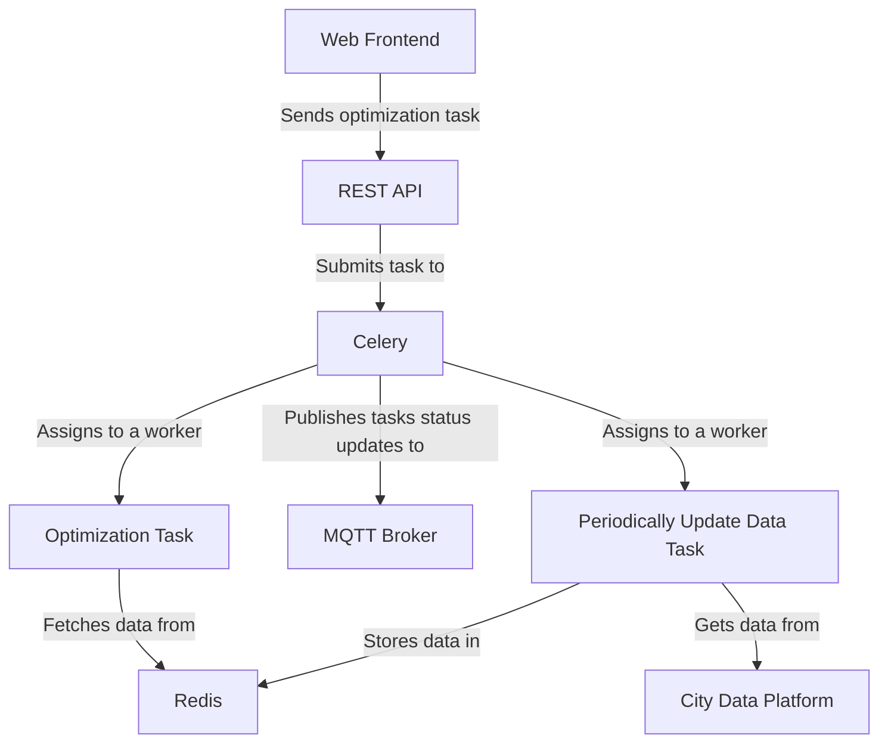

# Optimizing WasteContainer Location
[Repository :simple-github:](https://github.com/CitComAI-Hub/optimizing-container-location){:target="_blank" .md-button .md-button--primary-light }

<figure markdown>
  { loading=lazy }
</figure>

## Introduction
This AI services optimizes the placement of used cooking oil (UCO) containers in Valencia to improve urban recycling accessibility and promote environmental sustainability. The service
dresses the maximum covering location problem by proposing a genetic algorithm that utilizes context information to strategically position UCO recycling bins throughout the city. The goal is to enhance accessibility
for residents while reducing operational costs and environmental impact. 



## Deploy

1. Clone the repository and navigate to its root folder:
```bash
git clone https://github.com/CitComAI-Hub/optimizing-container-location.git && cd optimizing-container-location
```

2. Create and activate a Python virtual environment:
```bash
python3 -m venv ./venv && source ./venv/bin/activate
```

3. Install all requirements:
```bash
pip install -r requirements.txt
```

4. Create an `.env` file using `.env.example` as a guide: 
```bash
cp .env.example .env
```


5. Then edit the `env` variables so they point to your real data platform.
```bash
ENDPOINT_CB="127.0.0.1"
ENDPOINT_CB_PORT="9090"
ENDPOINT_REDIS="localhost"
REDIS_PORT="6379"
ENDPOINT_CELERY_BROKER="pyamqp://guest@localhost//"
```

6. Run Redis Container
```bash
docker run --name ocl-redis -d -p 6379:6379 redis
```

7. Run RabbitMQ Container
```bash
docker run --name ocl-rabbitmq -d -p 5672:5672 rabbitmq
```

8. Start Celery Worker
```bash
celery -A tasks worker --loglevel=info
```

9. Finally, start the server and open [http://127.0.0.1:5000](http://127.0.0.1:5000) in your browser:
```bash
flask --app server run
```