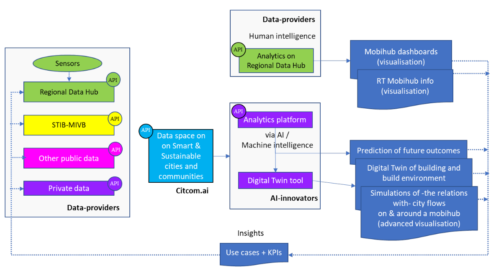

## Overview

The testing zone is located in Brussels, Belgium and is centred around innovations for dynamic traffic management and traffic sensor solutions. The leading partner is the region of Brussels' transport authority Bruxelles Mobilité, supported by Paradigm, FARI, imec and Digitaal Vlaanderen. 

The Charles Quint avenue and Annie Cordy tunnel are offered as primary testing location. Charles Quint is a major entry axis connecting the ring road of Brussels with its city center, the Annie Cordy tunnel is an extention to this axis. This axis provides an interesting and challenging traffic situation, common for large cities. Incidents (or measures) can have a profound and cascading effect on the entire regional traffic. The testing zone consists of:
- 9 crossings
- 1 tunnel, 2.9 km long - making it the longest tunnel in Belgium

Along the entire acis, multiple sensors and technologies are deployed to monitor and act upon the traffic situation. Innovators are offered access to the data these sensors produce to create, test and improve their solutions, e.g. validating their models or calibrate their sensors. Technologies that are currently deployes on the avenue are (or will be) offered through the TEF.
- ANPR cameras 
- XStream cameras
- Traffic light controllers
- Magnetometers
- DAI (automatic incident detection) cameras
- Air quality sensors
- and more...

All data is offered to innovators through the regional data platform.

Last but not least, innovators are also offered the ability to temporarily deploy their novel (traffic) sensors and / or solutions on the avenue.

## Services Offered

List the services available at the TEF Site related to the CitCom.ai Services Catalog. Provide a brief description of each service, and include any relevant links or documentation.

- **Access to a wide range of traffic data for AI training**: Access to real-time or historic traffic data (e.g. counting and categorisation of road users) coming from the Charles Quint axis
- **Deploy and test traffic solutions**: Temporary deployment of your solution or sensor in a real-life dynamic situation (the Charles Quint avenue or Annie Cordy tunnel)
- **Integrate traffic solutions**: Integrate your solution for testing purposes and have it used by Bruxelles Mobilité's traffic operators. Receive real-life validation, feedback and / or recommendations by end-users and validate your solution's effectiveness and / or accuracy.
- **CAVE**: CAVE or Computer Augmented Virtual Environment is a state-of-the-art immersive space that can visualize and simulate digital content and virtual objects to mimic real-world phenomena.
- **Local Digital Twin scenario development**: Develop a digital twin of a city, building or environment or employ the digital twin to simulate scenarios (e.g. on traffic, resilience, ...)

## Infrastructure Components

Describe the key infrastructure components available at the TEF Site, including data platforms, local digital twins, specific hardware, IoT platforms, or any other relevant technologies.

- **Data Platforms**: [Description of the data platforms available]
- **Local Digital Twins**: [Details about any local digital twin infrastructure]
- **Specific Hardware**: [Details about specialized hardware available, such as sensors, servers, etc.]
- **IoT Platforms**: [Information about IoT systems or platforms in use at the site]
- **Visualization platforms**: [Information about large scale visualisation components]
- **Other**: [Any other relevant infrastructure to showcase]

<table>
  <tr>
    <th colspan="2" style="text-align: center;">Specifications</th>
  </tr>
  <tr>
    <td><strong>Data Broker<strong></td>
    <td>
      &lt;no_specified> 
      <strong>- API:</strong> &lt;no_specified> 
      <strong>- Version:</strong> &lt;no_specified>
    </td>
  </tr>
  <tr>
    <td><strong>Data Source<strong></td>
    <td>&lt;no_specified></td>
  </tr>
  <tr>
    <td><strong>IdM &amp; Auth<strong></td>
    <td>&lt;no_specified></td>
  </tr>
  <tr>
    <td><strong>Data Publication<strong></td>
    <td>&lt;no_specified></td>
  </tr>
</table>

### Architecture

Provide a high-level overview of the architecture of the TEF Site, including the key components and technologies used. Include any relevant diagrams or visualizations to help stakeholders understand the infrastructure.

### European Data Space for Smart Communities (DS4SSCC)
<!-- 
{{ config.extra.labels.ds4ssc_compliant.yes_comp.data_sources }} {{ config.extra.labels.ds4ssc_compliant.yes_comp.data_broker }} {{ config.extra.labels.ds4ssc_compliant.yes_comp.data_api }} {{ config.extra.labels.ds4ssc_compliant.no_comp.data_idm_auth }} {{ config.extra.labels.ds4ssc_compliant.no_comp.data_publication }}

 -->

## Relevant datasets of the site

Describe the relevant datasets available at the site

- **Dataset_1**: [Description of the data set and link to Data Catalog: eg https://citcomai-hub.github.io/data_catalog/metadata_datasets/south_spain_valencia/]
- **Dataset_2**: [Description of the data set and link to Data Catalog: eg https://citcomai-hub.github.io/data_catalog/metadata_datasets/south_spain_valencia/]
- **Dataset_3**: [Description of the data set and link to Data Catalog: eg https://citcomai-hub.github.io/data_catalog/metadata_datasets/south_spain_valencia/]

## Key Stakeholders and Partners

Provide a list of the key stakeholders and partners involved in the TEF Site. Include any academic institutions, industry collaborators, and other stakeholders.

- **Stakeholder 1**: [Name and description of the stakeholder, e.g., university, research institute, industry partner]
- **Stakeholder 2**: [Description]
- **Stakeholder 3**: [Description]

## Contact Information

Provide contact details for those responsible for the TEF Site or who can provide more information to collaborators or users.

- **TEF Belgium Coordinator**: [Thomas De Meester, thomas.demeester@imec.be]
- **Site Coordinator**: [Mohamed Aarab, maarab@sprb.brussels]
- **Technical Support**: [Name and contact details]
- **General Inquiries**: [Name and contact details]

## Additional Information

Any other relevant information that might be useful to collaborators or developers working with the TEF Site, such as specific protocols, access instructions, or unique capabilities.

Example:
The TEF Site offers unique capabilities in [specific field], and it is open to collaboration with other EU projects in the area of [related field].

## Documentation and Resources

Link to any relevant documentation or resources, such as technical specifications, API documentation, or guides for using services at the TEF Site.

- [Documentation Link 1](#)
- [Documentation Link 2](#)

---

!!! info
    This page is part of the documentation hub for the CitCom.ai project. Please ensure that the information is up-to-date and accurate.
