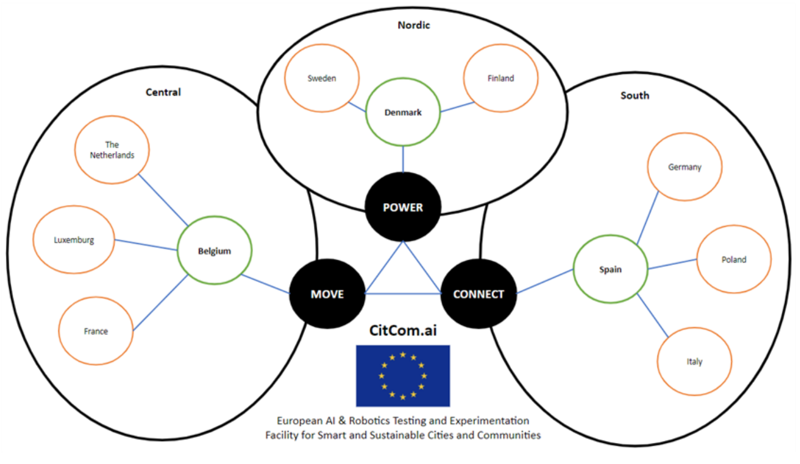

Overview of the current Testing and Experimentation Facility (TEF) nodes / sites.

## Nordic Supernode | POWER

| TEF Site | Node | Data Broker | API Broker | DS4SSCC Ref. Architecture | 
| -------- | ---- | ----------- | ---------- | ------------------------- |
| [DOLL Living Lab](./nordic_power/doll_living_lab.md) | Denmark | {{ config.extra.labels.data_brokers.fiware }} | {{ config.extra.labels.api_brokers.ngsi_ld }} | |
| [Aarhus City Lab](./nordic_power/aarhus_city_lab.md) | Denmark | {{ config.extra.labels.data_brokers.fiware }} | {{ config.extra.labels.api_brokers.ngsi_ld }} | |
| [DTU](./nordic_power/dtu.md) | Denmark | {{ config.extra.labels.data_brokers.fiware }} | {{ config.extra.labels.api_brokers.ngsi_ld }} | |
| [DTI](./nordic_power/dti.md) | Denmark |  | | |
| [Center Denmark](./nordic_power/center_denmark.md) | Denmark | {{ config.extra.labels.data_brokers.kafka }} | {{ config.extra.labels.api_brokers.custom }} | |
| [GATE21](./nordic_power/gate21.md) | Denmark | {{ config.extra.labels.data_brokers.fiware }} | {{ config.extra.labels.api_brokers.ngsi_ld }} | |
| [Tampere](./nordic_power/tampere.md) | Finland | {{ config.extra.labels.data_brokers.iot_ticket }}​ | {{ config.extra.labels.api_brokers.custom }} | |
| [RISE](./nordic_power/rise.md) | Sweden | {{ config.extra.labels.data_brokers.fiware }} | {{ config.extra.labels.api_brokers.ngsi_v2 }}   {{ config.extra.labels.api_brokers.ngsi_ld }} | |

## Central Supernode | MOVE

| TEF Site | Node | Data Broker | API Broker | DS4SSCC Ref. Architecture |
| -------- | ---- | ----------- | ---------- | ------------------------- |
| [Mechelen](./central_move/mechelen.md) | Belgium |  |  | |
| [Brussels](./central_move/brussels.md) | Belgium |  |  | |
| [Eindhoven](./central_move/eindhoven.md) | Netherlands | {{ config.extra.labels.data_brokers.fiware }} |  | |
| [Paris](./central_move/paris.md) | France |  |  | |
| [LIST](./central_move/list.md) | Luxembourg |  |  | |

## South Supernode | CONNECT

| TEF Site | Node | Data Broker | API Broker | DS4SSCC Ref. Architecture |
| -------- | ---- | ----------- | ---------- | ------------------------- |
| [Valencia](./south_connect/valencia.md) | Spain | {{ config.extra.labels.data_brokers.fiware }} | {{ config.extra.labels.api_brokers.ngsi_v2 }} | |
| [Milano](./south_connect/milano.md) | Italy | {{ config.extra.labels.data_brokers.fiware }} |  | |
| [Warsaw](./south_connect/warsaw.md) | Poland |  |  | |

