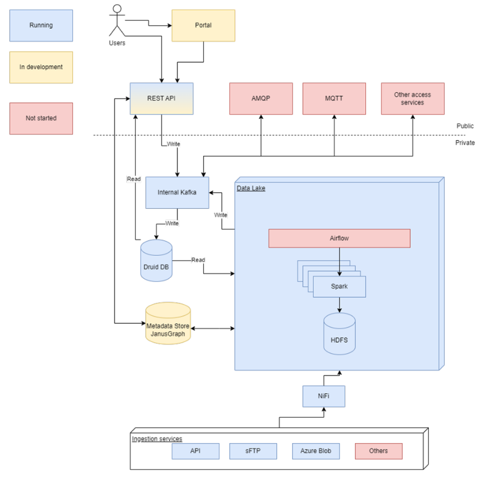
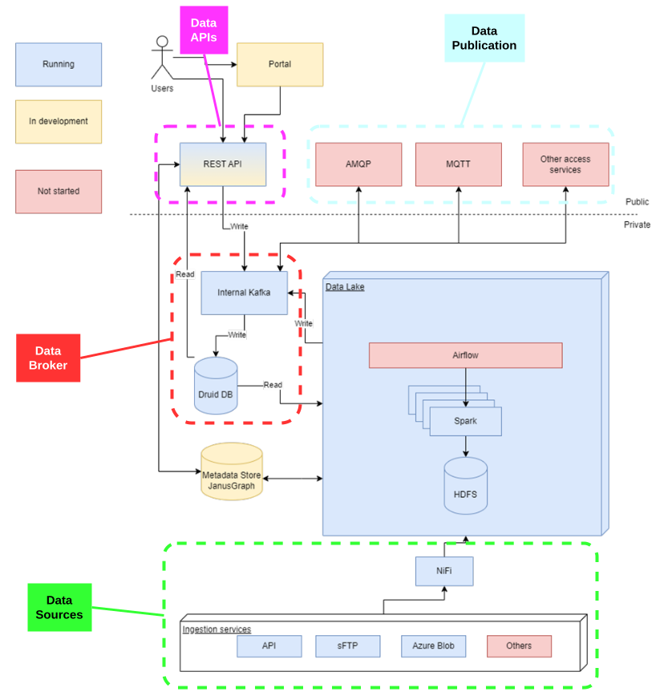

## Overview

## Data Platform

<table>
  <tr>
    <th colspan="2" style="text-align: center;">Specifications</th>
  </tr>
  <tr>
    <td><strong>Data Broker<strong></td>
    <td>
      {{ config.extra.labels.data_brokers.kafka }} 
      <strong>- API:</strong> {{ config.extra.labels.api_brokers.custom }} 
      <strong>- Version:</strong>&lt;no_specified\>
    </td>
  </tr>
  <tr>
    <td><strong>Data Source<strong></td>
    <td>Nifi</td>
  </tr>
  <tr>
    <td><strong>IdM &amp; Auth<strong></td>
    <td>&lt;no_specified\></td>
  </tr>
  <tr>
    <td><strong>Data Publication<strong></td>
    <td>MQTT, AMQP</td>
  </tr>
</table>

### European Data Space for Smart Communities (DS4SSCC)

{{ config.extra.labels.ds4ssc_compliant.yes_comp.data_sources }} {{ config.extra.labels.ds4ssc_compliant.yes_comp.data_broker }} {{ config.extra.labels.ds4ssc_compliant.yes_comp.data_api }} {{ config.extra.labels.ds4ssc_compliant.no_comp.data_idm_auth }} {{ config.extra.labels.ds4ssc_compliant.yes_comp.data_publication }}

