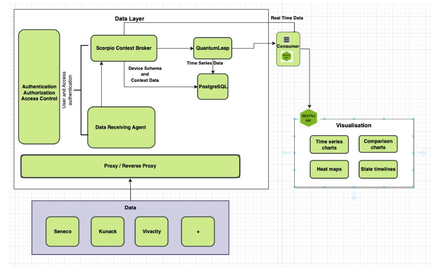

## Overview

Digital Outdoor Living Lab (DOLL) is located in Albertslund, Denmark and is dedicated to advancing research and development in Smart City technologies, including Intelligent Traffic Systems, Outdoor Lighting and Structural Health. This site is equipped with state-of-the-art infrastructure and is a key site in the CitCom.ai project, facilitating collaboration between cities and communities, industrial partners (AI innovators) and research institutions. The site hosts a Local Digital Twin with a network of data-providing partners

## Services Offered

List the services available at the TEF Site related to the CitCom.ai Services Catalog. Provide a brief description of each service, and include any relevant links or documentation.

- **DOLL Basic Membership**: Testing and Experimentation of ONE single Use-Case/Device Type. Exposure and networking provided through DOLL Visitor Service and European project activities. Integration of data into Local Digital Twin.
- **DOLL Expanded Membership**: Test and Experimentation of MULTIPLE Use-Cases/Device Types. Exposure and networking provided through DOLL Visitor Service and European project activities. Integration of data into Local Digital Twin. Access to Data from Site through RESTful API from LDT. Data-economy matchmaking with relevant consumers. Additional KPIs regarding Visitor Service Services.
- **DOLL Expanded ITS Membership**: As Expanded Membership, but aimed specifically at Intelligent Traffic Systems operators/providers. Includes regulatory approval, integration to local Traffic Light Controller by state-approved system integrator. 

## Infrastructure Components

Describe the key infrastructure components available at the TEF Site, including data platforms, local digital twins, specific hardware, IoT platforms, or any other relevant technologies.

- **Data Platforms**: Data is availible from the LDT via a RESTful interface.
- **Local Digital Twins**: LDT based on Scorpio Context Broker, providing data in Smart Data Model / NGSI-LD format.
- **Specific Hardware**: Rich network of sensors, cameras. No specific Compute resources.
- **IoT Platforms**: Partner-provided platforms used for demonstration such as Sensative's Yggio. OS2-IoT for publicically-available data.
- **Visualization platforms**: Basic Grafana and Streamlit dashboards and demo apps. Unreal Engine-based Virtual Lab, fully open-world photorealistic virtual environment.
- **Other**: DOLL has free reign to install, test and integrate any type of device in the lab. DOLL has the Municipal mandate in the area, and therfore operates on behalf of the local municipality in this area.

<table>
  <tr>
    <th colspan="2" style="text-align: center;">Specifications</th>
  </tr>
  <tr>
    <td><strong>Data Broker<strong></td>
    <td>
      {{ config.extra.labels.data_brokers.fiware }} 
      <strong>- API: /strong> &lt;<\>Scorpio 
      <strong>- Version:</strong> ??
    </td>
  </tr>
  <tr>
    <td><strong>Data Source<strong></td>
    <td>&lt;\>Scorpio Context Broker</td>
  </tr>
  <tr>
    <td><strong>IdM &amp; Auth<strong></td>
    <td>&lt;no_specified\>KeyCloak</td>
  </tr>
  <tr>
    <td><strong>Data Publication<strong></td>
    <td>&lt;no_specified\>RESTful API</td>
  </tr>
</table>

### Architecture

Provide a high-level overview of the architecture of the TEF Site, including the key components and technologies used. Include any relevant diagrams or visualizations to help stakeholders understand the infrastructure.

### European Data Space for Smart Communities (DS4SSCC)

{{ config.extra.labels.ds4ssc_compliant.yes_comp.data_sources }} {{ config.extra.labels.ds4ssc_compliant.yes_comp.data_broker }} {{ config.extra.labels.ds4ssc_compliant.yes_comp.data_api }} {{ config.extra.labels.ds4ssc_compliant.yes_comp.data_idm_auth }} {{ config.extra.labels.ds4ssc_compliant.no_comp.data_publication }}

## Relevant datasets of the site

Describe the relevant datasets available at the site

- **Dataset_1**: [Description of the data set and link to Data Catalog: eg https://citcom-vrain.github.io/data_catalog/metadata_datasets/south_spain_valencia/]
- **Dataset_2**: [Description of the data set and link to Data Catalog: eg https://citcom-vrain.github.io/data_catalog/metadata_datasets/south_spain_valencia/]
- **Dataset_3**: [Description of the data set and link to Data Catalog: eg https://citcom-vrain.github.io/data_catalog/metadata_datasets/south_spain_valencia/]

## Key Stakeholders and Partners

Provide a list of the key stakeholders and partners involved in the TEF Site. Include any academic institutions, industry collaborators, and other stakeholders.

- **Stakeholder 1**: Albertslund Municipality, Local Municipality, operationally responsible in tandem with DOLL.
- **Stakeholder 2**: We Build Denmark, National Cluster for Buildings and Civil Engineering, parent organisation and owner of DOLL. 
- **Stakeholder 3**: Denmarks Technical University, National Technical University, key stakeholder in research-driven projects.
- **Stakeholder 4**: Aleksandra Institute, FORCE Technology, National RTOs with project-based engagement in DOLL, knowledge partners.

## Contact Information

Provide contact details for those responsible for the TEF Site or who can provide more information to collaborators or users.

- **Site Coordinator**: Line Johansen, line.nykjaer.johansen@webuilddenmark.dk
- **Technical Support**: Ben Cahill, ben.cahill@webuilddenmark.dk
- **General Inquiries**: Ben Cahill, ben.cahill@webuilddenmark.dk

## Additional Information

Any other relevant information that might be useful to collaborators or developers working with the TEF Site, such as specific protocols, access instructions, or unique capabilities.

Example:
The TEF Site offers unique capabilities in Intelligent Traffic Systems, Outdoor Lighting, Environmental Monitoring, and it is open to collaboration with other EU projects in the area of Infrastructural Health Monitoring, Dataspaces, Data Economy, Edge AI with Computer Vision.

## Documentation and Resources

Link to any relevant documentation or resources, such as technical specifications, API documentation, or guides for using services at the TEF Site.

- [Documentation Link 1](#)
- [Documentation Link 2](#)

---

!!! info
    This page is part of the documentation hub for the CitCom.ai project. Please ensure that the information is up-to-date and accurate.
